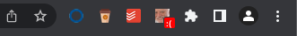
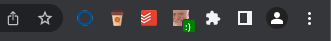
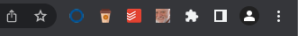

# Harold

* Can you recall what you learned during the last weeks?
* What was the most interesting thing that you came across? Blog posts, ideas, code snippets, CLI commands, ....
* Wouldn't it be better to have a weekly overview?

Get to know an easily accessible and smart sticky-note tool aware of your daily updates and weekly overviews. Meet Harold.


Harold, the emotional sticky-note tool which encourages you to keep note of your daily discoveries and be more mindful of your digital journey and growth path.

### In case you found Harold sad:



Just add your daily note to the sticker.

### To make Harold supper happy:



Go to your desired website to save your notes for the long term, you will find more about this on the setting page.


But most of the time you should find him without any emotion



## Development

To develop and test this plugin on Google Chrome please clone this repository on your machine.
then inside of Firefox address bar go to
```chrome://extensions```
Click on `Load unpacked` and choose manifest.json file, now you can see the details, errors and test the extention.
